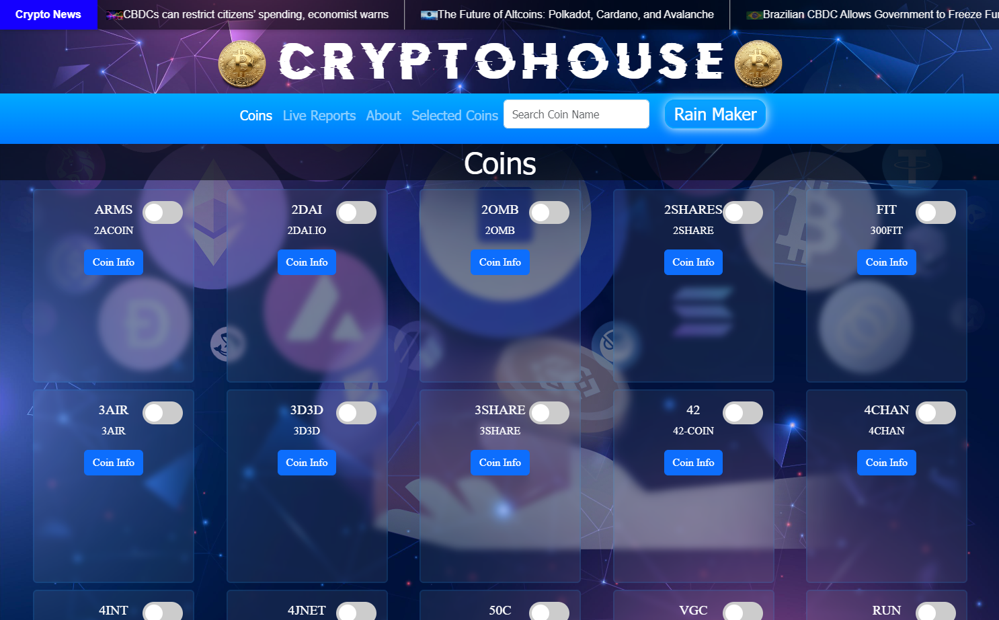

  

<h1 align="center">CryptoHouse - Bitcoin Site</h1>

  <strong>A Web Application for Real-Time Cryptocurrency Information</strong>

  <a href="#features">Features</a> •
  <a href="#design-and-styling">Design and Styling</a> •
  <a href="#technologies-used">Technologies Used</a> •
  <a href="#installation-and-usage">Installation and Usage</a> •
  <a href="#acknowledgments">Acknowledgments</a> •
  <a href="#about-the-developer">About the Developer</a>

  

## Features

- ## Coin Selection:

 Users can toggle the coins they are interested in, with a limit of 5 coins.
- ## Expanded Information:

 Each coin card displays additional information that can be expanded or collapsed.
- ## Real-Time Reports:

 Live reports of selected cryptocurrencies are displayed in a graph format.
- ## Search Capability:

 Users can search for specific coin names.
- ## Crypto News:

 The application fetches and displays real-time news about cryptocurrencies.

## Design and Styling

The project incorporates visually appealing design and CSS styles, leveraging the following files:

- style.css: Contains custom styles for the website layout and components.
- cryptonews.css: Includes styles specific to the crypto news section.
- modal.css: Defines styles for the modal window.
- about.css: Contains styles for the "About Me" section.
- snowcrypto.css: Applies snowfall effect to the background.

## Technologies Used

- HTML: The markup language used for structuring the web pages.
- CSS: Styling language used for customizing the website's appearance.
- Bootstrap: A CSS framework used to enhance the responsiveness and design of the website.
- JavaScript: Programming language used to add interactivity and dynamic functionality.
- jQuery: JavaScript library used to simplify DOM manipulation and AJAX requests.
- AJAX: Technique used to fetch data from the CoinGecko API for real-time updates.
- CanvasJS: JavaScript charting library used to create dynamic graphs for cryptocurrency reports.

## Installation and Usage

To use the CryptoHouse web application, follow these steps:

1. Clone the repository: git clone [repository-url]
2. Open the project in a web browser.
3. Explore the different sections of the website, such as the Coins, Reports, and About sections.
4. Toggle the coins of interest by clicking on the checkboxes and selecting up to 5 coins.
5. Expand the coin cards to view additional information by clicking the "Coin Info" button.
6. Use the search bar to filter and find specific coin names.
7. Click the "Live Reports" link to view real-time reports of the selected cryptocurrencies.
8. Click the "Scroll Up" link to scroll back to the top of the page.
9. Click the "Rain Maker" button to activate the crypto rain animation.

## Credits

* Bootstrap: https://getbootstrap.com/
* CoinGecko API: https://www.coingecko.com/
* CanvasJS: https://canvasjs.com/

## Acknowledgments

* The CoinGecko API: The project utilizes the CoinGecko API to fetch real-time cryptocurrency data and news.

## About the Developer

CryptoHouse is the second project developed by Eitan Lander, a passionate web developer focusing on full-stack development. Eitan is currently studying at John Bryce College for Full Stack Web Development and possesses a strong foundation in HTML, CSS3, JavaScript, jQuery, AJAX, REST API, CanvasJS, and Bootstrap. Additionally, Eitan has expertise in design using Photoshop and strives to create visually appealing and user-friendly websites.

## License

This Task Board project is open-source and released under the MIT License. You are free to use, modify, and distribute the code as per the terms of the license.

## Credits

This Task Board project was created by Eitan Lander. If you have any questions or feedback, please contact me at eitanlander@gmail.com.
